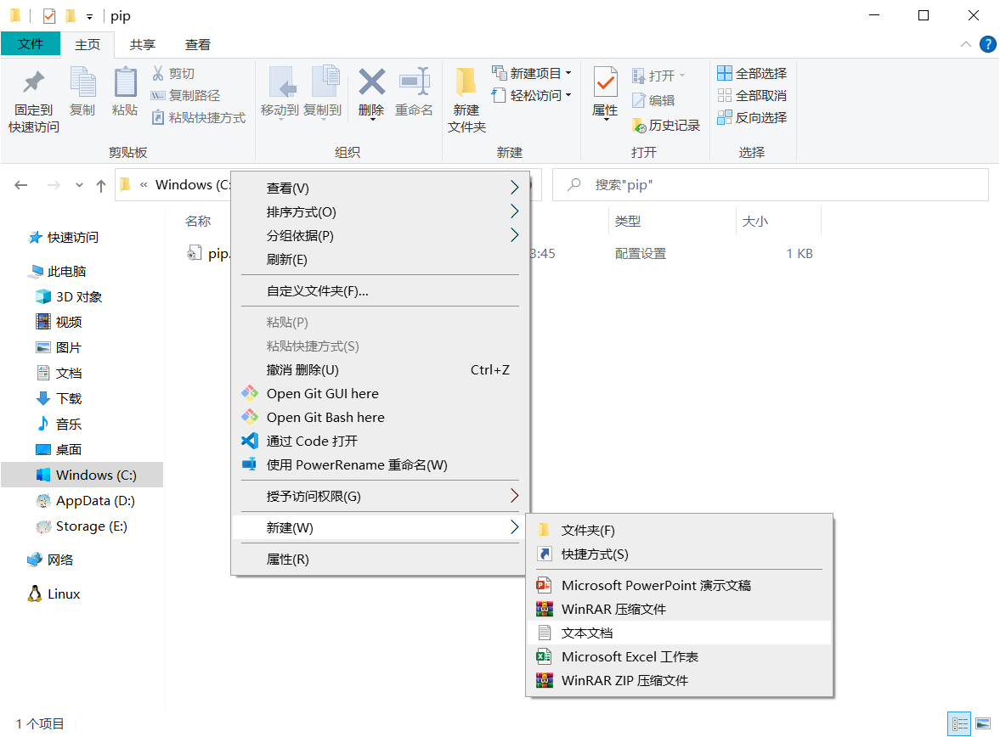

# 1.程序设计语言的分类

### 1.程序设计语言

程序设计语言分为**机器语言**、**汇编语言**、**高级语言**，其中Python是高级语言

&#x20; **机器语言**：二进制语言，可由计算机硬件直接识别和执行

&#x20; **汇编语言**：机器语言的助记符

&#x20; **高级语言**：接近自然语言的一种计算机程序设计语言

### 2.编译和解释

程序设计语言也可分为**编译型语言**和**解释型语言**，其中Python是解释型语言

&#x20; **编译型**：也称为**静态语言**，由源代码（高级语言代码）通过 **编译器Compiler** 转换为目标代码（机器语言代码）的过程，不可跨平台

<figure><figcaption></figcaption></figure>

&#x20; **解释型**：也称为**脚本语言**，由源代码（高级语言代码）通过 **解释器Interpreter** 逐条转换成目标代码的同时逐条运行目标代码的过程，可跨平台

<figure><figcaption></figcaption></figure>

