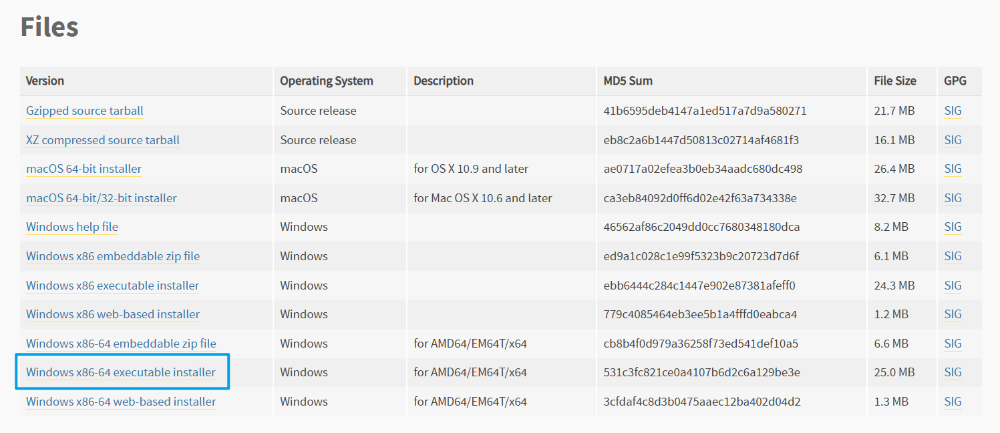
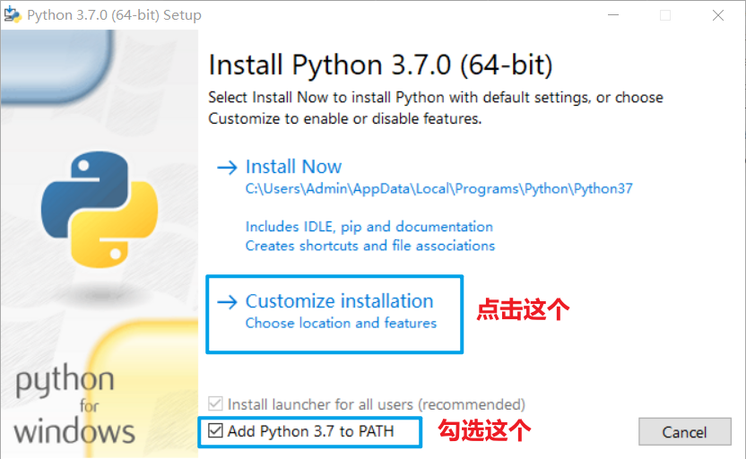
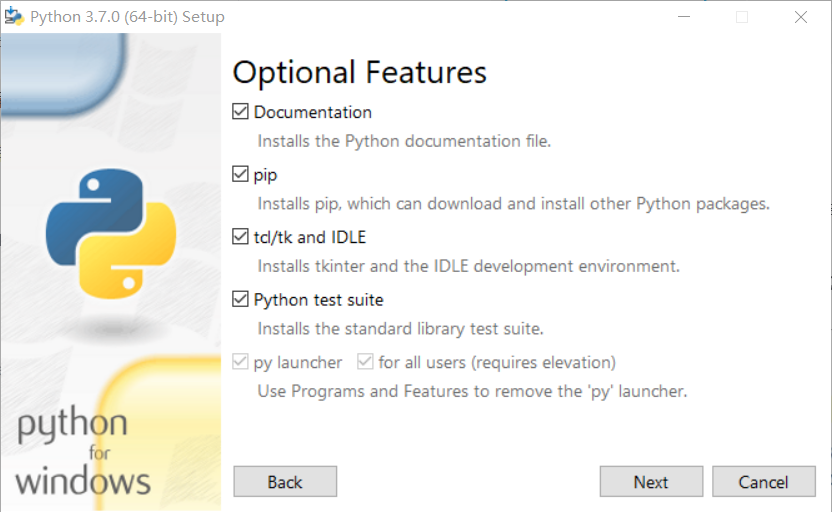
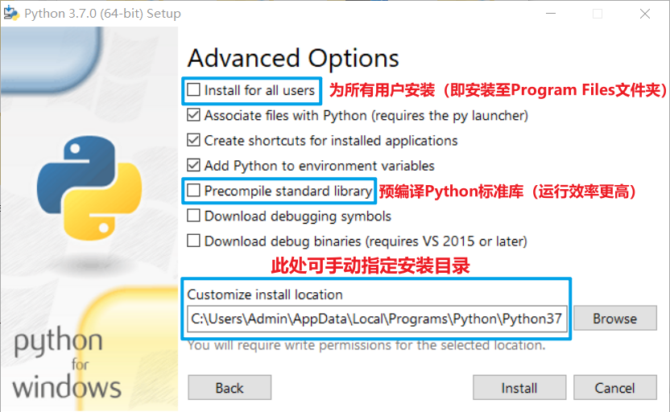
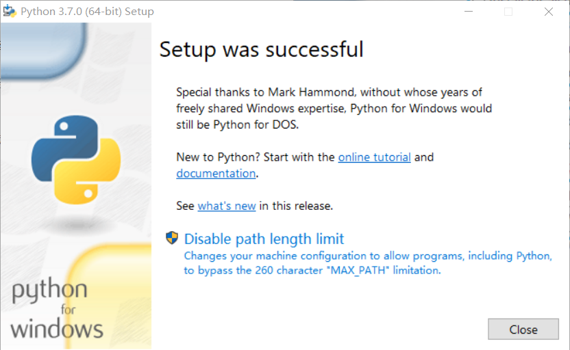
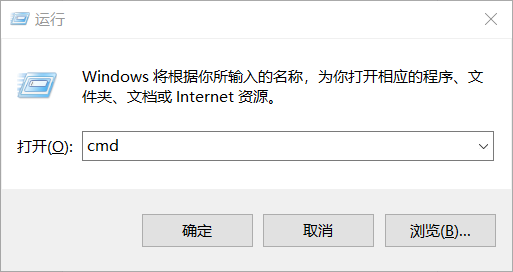
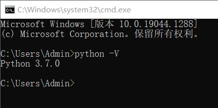

# 1.安装Python解释器

### 1.下载Python

前往 [`Python官网`](https://www.python.org/) 下载安装包，建议下载64位的安装包（ `Windows x86-64 executable installer` ）


```
https://www.python.org/downloads/
```


<figure><figcaption></figcaption></figure>

### 2.安装Python

双击Python安装包打开安装窗口，按照下列操作过程逐步安装

#### 2.1.勾选 "添加到PATH" 和 点击 "个性化安装"

<figure><figcaption></figcaption></figure>

#### 2.2.这一页保持默认即可，点击 "Next" 进入到下一页（高级选项）

<figure><figcaption></figcaption></figure>

#### 2.3.这一页可勾选 "预编译标准库"（可提高运行效率），安装位置可根据个人喜好酌情勾选或设置

<figure><figcaption></figcaption></figure>

### 3.检查安装状态

提示 "Setup was successful" 即表明已经安装完毕，这时候可以关掉安装程序和检查安装状态

<figure><figcaption></figcaption></figure>

#### 3.1. `Win+R` 组合键打开运行，输入 `cmd` 后按 `Enter` 键

<figure><figcaption></figcaption></figure>

#### 3.2.在 `cmd` 中输入以下指令并查看是否显示版本号（显示版本号即安装成功）


```batch
python -V
```


<figure><figcaption></figcaption></figure>

