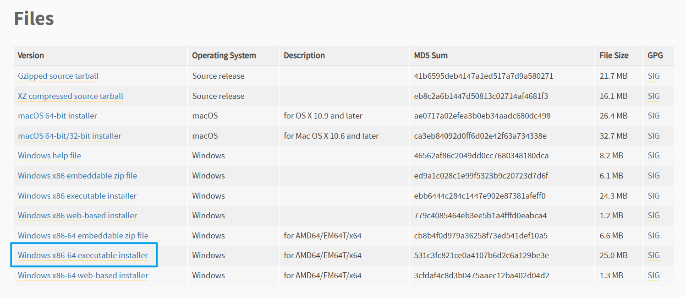
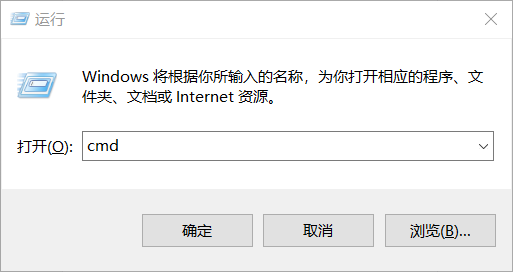

# 1.安装Python解释器

### 1.下载Python

前往 [`Python官网`](https://www.python.org/) 下载安装包，建议下载64位的安装包（ `Windows x86-64 executable installer` ）

推荐以下Python版本：

&#x20; Windows10/11：`3.7` `3.11` `3.13（最新版）`

&#x20; Windows7：`3.7`（最高`3.8`）

&#x20; WindowsXP：最高`3.4`


```
https://www.python.org/downloads/
```


<figure><figcaption></figcaption></figure>

### 2.安装Python

双击Python安装包打开安装窗口，按照下列操作过程逐步安装

#### 2.1.勾选 `Add Python 3.7 to PATH`（将Python添加到环境变量）后点击 `Customize installation`（自定义安装）进入到 `Optional Features`（可选功能）

<figure><figcaption></figcaption></figure>

#### 2.2.这一页保持默认即可，点击 `Next`（下一页） 进入到 `Advanced Options`（高级选项）

<figure><figcaption></figcaption></figure>

#### 2.3.这一页可在勾选 `Precompile standard library`（预编译Python标准库，可提高运行效率）后点击 `Install` 安装

#### 安装位置可根据个人使用习惯酌情勾选 `Install for all users`（安装至Program Files文件夹）或设置 `Customize install location`（手动指定安装目录）

<figure><figcaption></figcaption></figure>

### 3.检查安装状态

显示 `Setup was successful` 即表明Python已经安装完毕，这时候可以点击 `Close` 关掉安装程序和检查安装状态

<figure><figcaption></figcaption></figure>

#### 3.1. `Win+R` 组合键打开运行，输入 `cmd` 后按 `Enter` 键

<figure><figcaption></figcaption></figure>

#### 3.2.在 `cmd` 中输入以下指令并查看是否显示版本号（显示版本号即表明安装成功）


```batch
python -V
```


<figure><figcaption></figcaption></figure>

