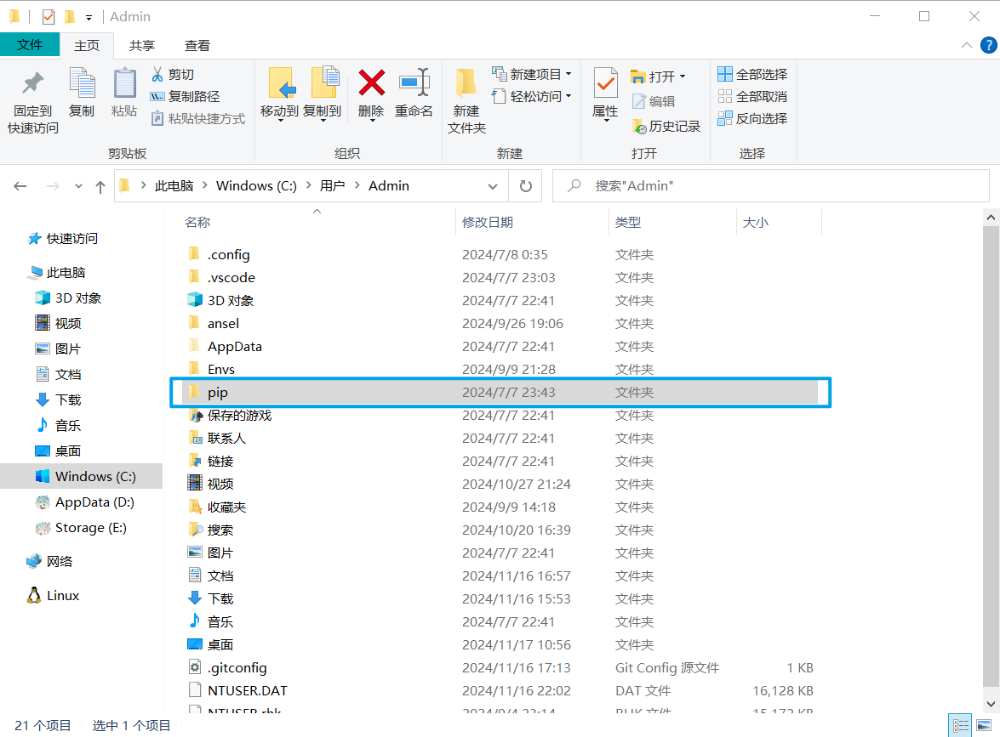
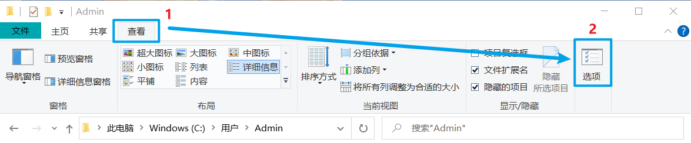
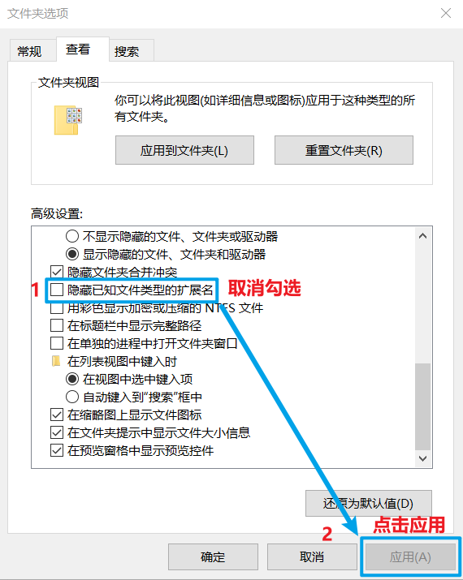

# 2.更换软件包源

进入到你的用户文件夹下（可以从 `C:\Users` 文件夹下找，例如我的用户名是 `Admin` ，我的用户文件夹就是 `C:\Users\Admin` ）

### 1.新建一个文件夹 `pip`

<figure><figcaption></figcaption></figure>

### 2.进入 `pip` 文件夹，新建一个文件 `pip.ini`

右键 新建 -> 文本文档，将创建好的文本文档重命名为 `pip.ini`

<figure><figcaption></figcaption></figure>

如果发现改不了扩展名，可按照以下步骤逐步操作：

<figure><figcaption></figcaption></figure>

<figure><figcaption></figcaption></figure>

### 3.打开 `pip.ini` 写入以下内容后保存


```ini
[global]
timeout=6000
index-url=https://pypi.tuna.tsinghua.edu.cn/simple
[install]
trusted-host=https://pypi.tuna.tsinghua.edu.cn
```


