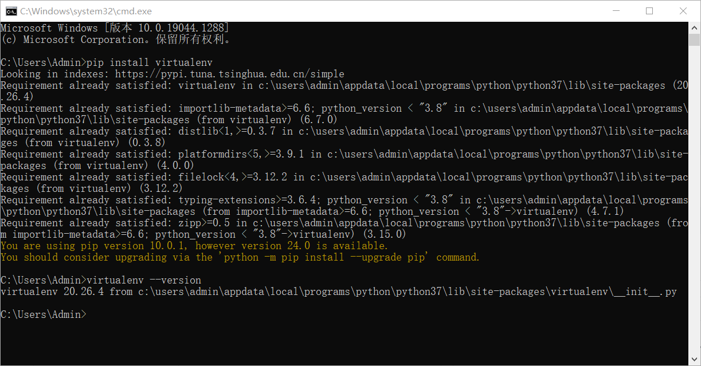

# 3.安装虚拟环境

### 1.安装虚拟环境 `virtualenv`

#### 1.1.打开 `cmd`，输入以下指令安装 `virtualenv`


```batch
pip install virtualenv
```


#### 1.2.在安装完毕后输入以下指令检查是否安装成功


```batch
virtualenv --version
```


<figure><figcaption></figcaption></figure>

### 2.安装虚拟环境管理器 `virtualwrapper`

在 `cmd` 中输入以下指令安装 `virtualwrapper`


```batch
pip install virtualenvwrapper-win
```


<figure><figcaption></figcaption></figure>
