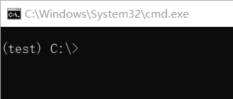
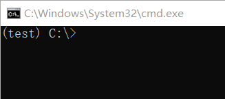

# 4.创建虚拟环境

打开 `文件资源管理器` ，在地址栏中输入 `cmd` 后按 `Enter`

### 1.创建虚拟环境

输入以下指令创建虚拟环境（我这里创建的是一个名为test的虚拟环境）


```batch
mkvirtualenv test
```


<figure><figcaption></figcaption></figure>

### 2.激活虚拟环境

输入以下指令激活虚拟环境（我这里激活的是一个名为test的虚拟环境）


```batch
workon test
```


<figure><figcaption></figcaption></figure>

