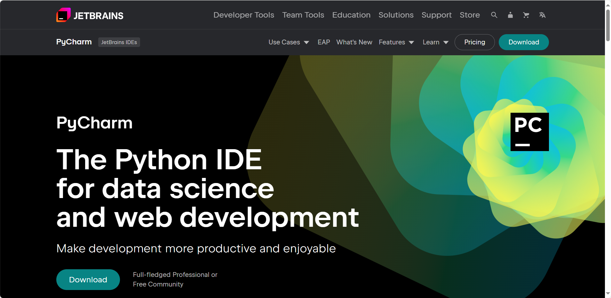
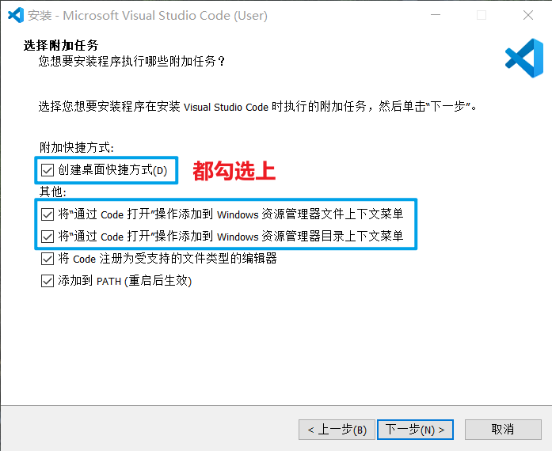
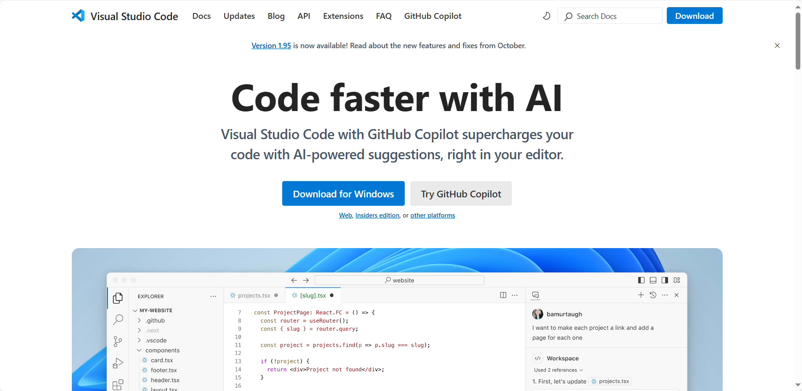

# 5.安装代码编辑器

Python代码编辑器可以选择 `PyCharm` 或 `VSCode`

### 1.安装PyCharm

`PyCharm` 是一款强大的Python调试工具，有社区版和专业版两种版本，一般来说社区版完全够用

#### 1.1.前往 `jetbrains` 官网下载安装包


```
https://www.jetbrains.com/pycharm/
```


#### 1.2.PyCharm的常用设置：

&#x20; 更改外观：Settings -> Appearance

&#x20; 更改字体大小：Settings ->Editor -> Font

<figure><figcaption></figcaption></figure>

### 2.安装VSCode

`Visual Studio Code` 是一款免费开源的代码编辑器，可安装Python插件化身为Python调试工具

#### 2.1.前往 `VSCode` 官网下载安装包

```
https://code.visualstudio.com/
```

#### 2.2.安装时推荐勾选以下几个选项：

<figure><figcaption></figcaption></figure>

#### 2.3.在安装完毕后需安装以下插件：

&#x20; `Chinese (Simplified) (简体中文) Language Pack for Visual Studio Code`  #VSCode中文语言包

&#x20; `Python`  #Python扩展

&#x20; `Black Formatter`  #格式化Python代码

#### 2.4.VSCode的常用设置：

&#x20; 自动换行：`editor.wordWrap:on`

&#x20; 关闭工作区信任：`security.workspace.trust.enabled:false`

&#x20; 设置主题：设置 -> 主题 -> 颜色主题

&#x20; 关闭编辑器自动更新：`update.mode:none`

&#x20; 关闭插件自动更新： `extensions.autoUpdate:false` `extensions.autoCheckUpdates:false`

<figure><figcaption></figcaption></figure>

