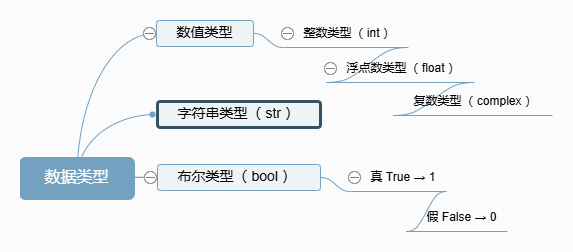

# 4.数据类型

在Python中，有以下几种数据类型：**数值类型**、**字符串类型**（ **`str`** ）、**布尔类型**（ **`bool`** ）

其中，**数值类型包括整数类型（ `int` ）、浮点数类型（ `float` ）和复数类型（ `complex` ）**

<figure><figcaption></figcaption></figure>

通过菜鸟工具制作 - [https://www.jyshare.com/more/kitymind/index.html](https://www.jyshare.com/more/kitymind/index.html)

